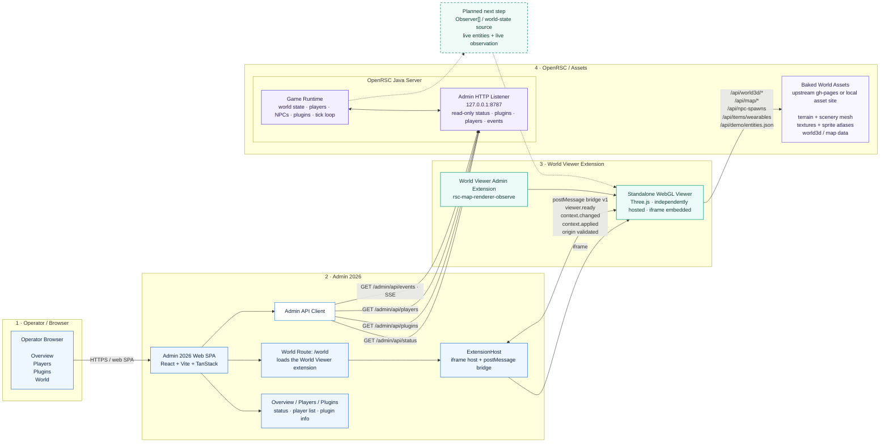

# Admin 2026 Architecture — v0.0.5

> System map for the current Admin 2026 + World Viewer integration.
>
> Version: **v0.0.5**
> Updated: **2026-09-27**

This diagram is the current high-level architecture snapshot for the Admin 2026 control plane, the hosted World Viewer Admin Extension, the OpenRSC Java server, and the baked world-asset pipeline.

Solid arrows represent implemented connections. Dashed arrows represent the next planned integration boundary.



## Current state

Implemented today:

- OpenRSC exposes the read-only Admin API on the localhost Admin HTTP listener.
- Admin 2026 consumes status, plugin, player, and SSE event endpoints.
- `/world` is registered through the generic Admin Extension system.
- `ExtensionHost` embeds the standalone World Viewer via iframe.
- Admin and the viewer communicate over the versioned **postMessage bridge v1**.
- The bridge currently carries `viewer.ready`, `context.changed`, and `context.applied`.
- Cross-frame messages are origin validated.
- The viewer independently loads static baked world assets.
- Full WebGL rendering has been browser-verified through Admin 2026.

## Next boundary

The next World Viewer integration is deliberately read-only:

```text
OpenRSC Game Runtime
        ↓
bounded transport-safe world state
        ↓
Observer[] / world-state adapter
        ↓
World Viewer
```

That lane should initially carry live entities and observation state only.

It must not introduce world mutations ahead of the Admin security lane:

```text
authentication
    ↓
capabilities
    ↓
audit contract
    ↓
explicit typed mutations
```

## Ownership boundary

### Admin 2026 owns

- authentication and operator identity;
- capability checks;
- navigation and route ownership;
- selected server/world context;
- extension registry and hosting;
- Admin API clients;
- administrative inspectors and actions;
- mutation validation and audit.

### World Viewer owns

- baked world rendering;
- Three.js/WebGL scene;
- terrain and scenery;
- world coordinates;
- entity visualization;
- interpolation;
- observer merging/reconciliation;
- map-specific presentation.

### OpenRSC owns

- authoritative game state;
- players, NPCs, objects, plugins, and tick loop;
- existing server behavior;
- transport-safe Admin snapshots/events;
- eventual authoritative world-state source.

## Related docs

- [Admin Extensions](./admin-extensions.md)
- [World Observer Admin Extension](./world-observer-extension.md)
- [Backend API](./backend-api.md)
- [GUI Stack](./gui-stack.md)
- [Current Implementation Lanes](./next-slices.md)
- [Tasklist](./tasklist.md)

## Primary architectural rule

> **Native in experience, independent in implementation.**

For the World Viewer specifically:

> **Observe first, inspect second, diagnose third, and only then operate.**
